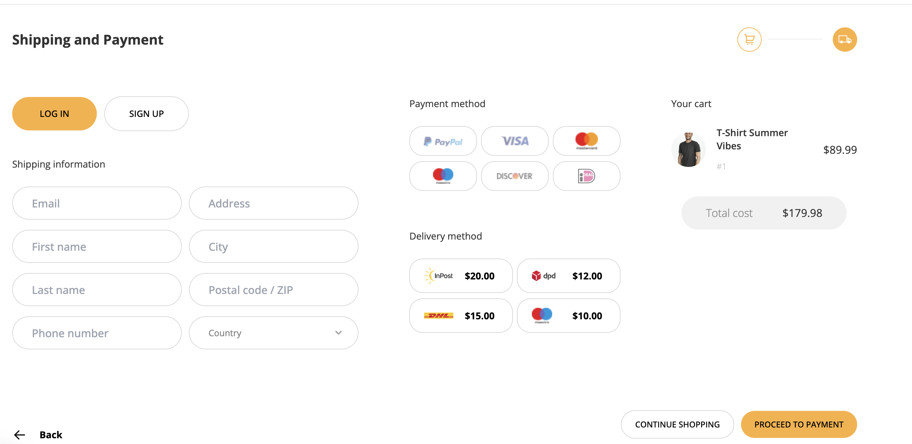
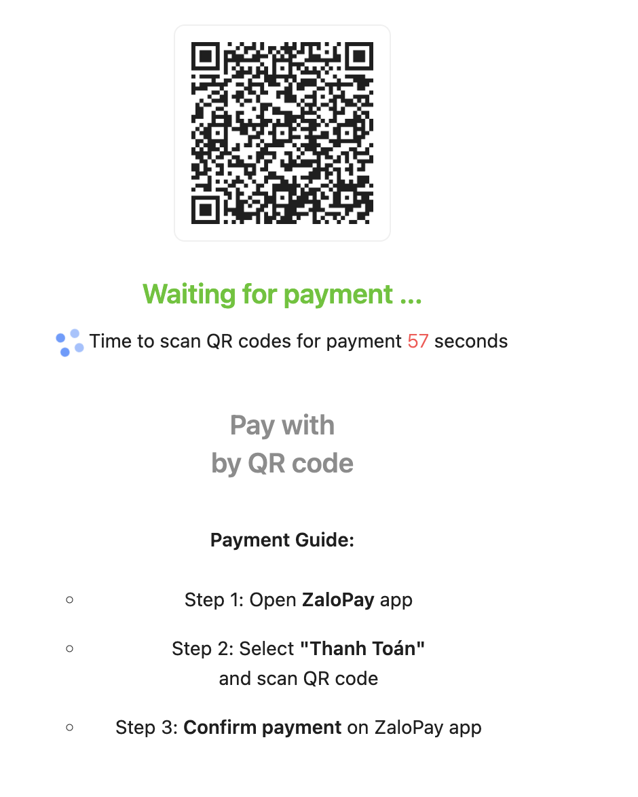
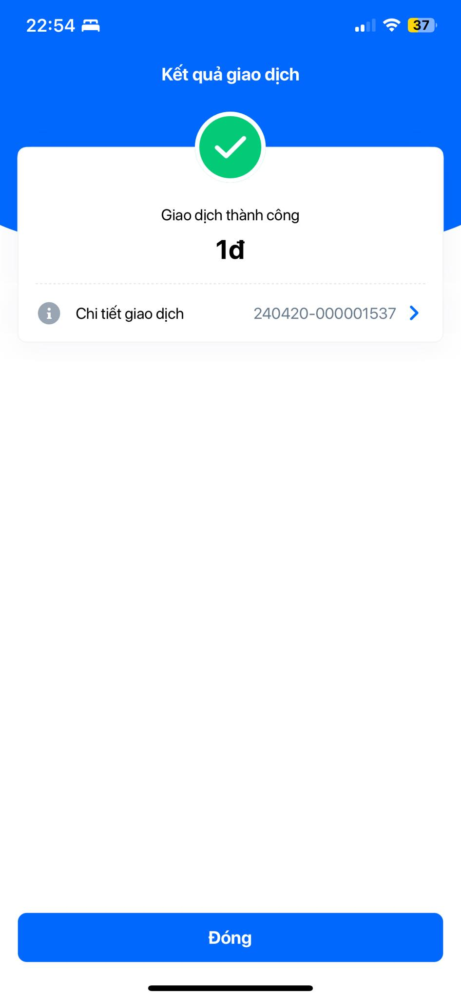
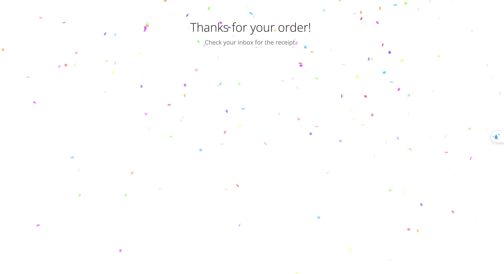

# Costume Rental Service

Link deploy: https://clothes-rent-app.vercel.app

# Integrate Payment with ZaloPay

## Config

1. Update `next.config.js` file with your [Merchant information](https://docs.zalopay.vn/v2/start/):

```sh
ZLP_MERCHANT_APP_ID="your_app_id_here"
ZLP_MERCHANT_KEY1="your_key1_here"
ZLP_MERCHANT_KEY2="your_key2_here"
ZLP_MERCHANT_CALLBACK_URL="zalopay_merchant_endpoint_here"
```

Or you can use this [testing merchant account](https://docs.zalopay.vn/v2/start/#A-V).

```sh
ZLP_MERCHANT_APP_ID: '2554',
ZLP_MERCHANT_KEY1: 'sdngKKJmqEMzvh5QQcdD2A9XBSKUNaYn',
ZLP_MERCHANT_KEY2: 'trMrHtvjo6myautxDUiAcYsVtaeQ8nhf',
ZLP_MERCHANT_ENDPOINT: 'https://sb-openapi.zalopay.vn/v2/',
ZLP_MERCHANT_CALLBACK_URL:'ngrok http 3000/api/callback'
```

## Install ngrok

MacOS:

```sh
brew cask install ngrok
```

Register ngrok account: https://dashboard.ngrok.com/

You can find your_auth_token after register ngrok in https://dashboard.ngrok.com/get-started/setup/macos

```sh
ngrok config add-authtoken <your_auth_token>
```

## Run Source

### Expose ngrok callback

```
ngrok http 3000
```


Add callback url to next.config.js, example:

```
ZLP_MERCHANT_CALLBACK_URL= https://3a7a-2a09-bac5-d46a-16c8-00-245-53.ngrok-free.app/api/callback
```

Install dependencies

```
yarn install
```

Run dev

```
yarn dev
```

Your app is running at: http://localhost:3000

Please register and login with your information

# Usage

1. Install ZaloPay QC App [https://docs.zalopay.vn/v2/start/#A](https://docs.zalopay.vn/v2/start/#A).


Remember to trust the app, in IPhone you come to Settings -> General -> VPN & Device Management -> TRUST ZION JOIN STOCK COMPANY

2. Register and deposit money into wallet (not worry, it is free).

3. Scan QR Code And Test with ZaloPay QC App.








